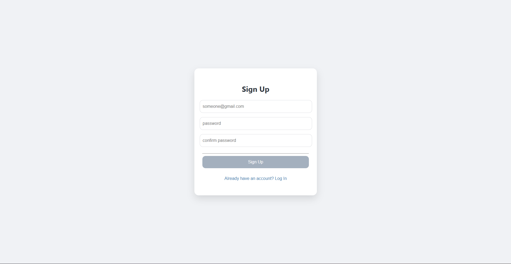
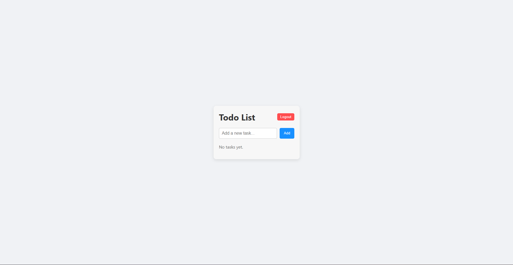

# Todo List App

A simple and secure **Todo List** web application built with React, Node.js, Express, and JWT for authentication. Users can sign up, log in, and manage their personal tasks with a clean and minimal interface.

---

## Features

- User registration and login with JWT-based authentication  
- Protected routes for authenticated users only  
- Create, read, update, and delete (CRUD) todos  
- Mark tasks as completed or pending  
- Responsive UI with a centered todo card layout  
- Logout functionality that clears authentication token  
- Error handling and basic validation on both client and server

---

### Sign Up Screen

### Todo List (Logged In)

---

## Tech Stack

**Frontend**

- React  
- JavaScript   
- CSS 

**Backend**

- Node.js  
- Express  
- JSON Web Token (JWT) for authentication  

